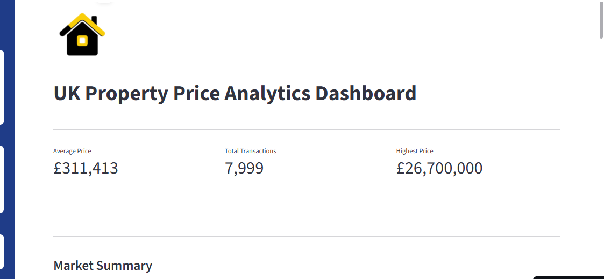
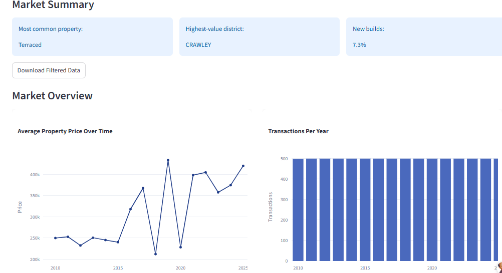
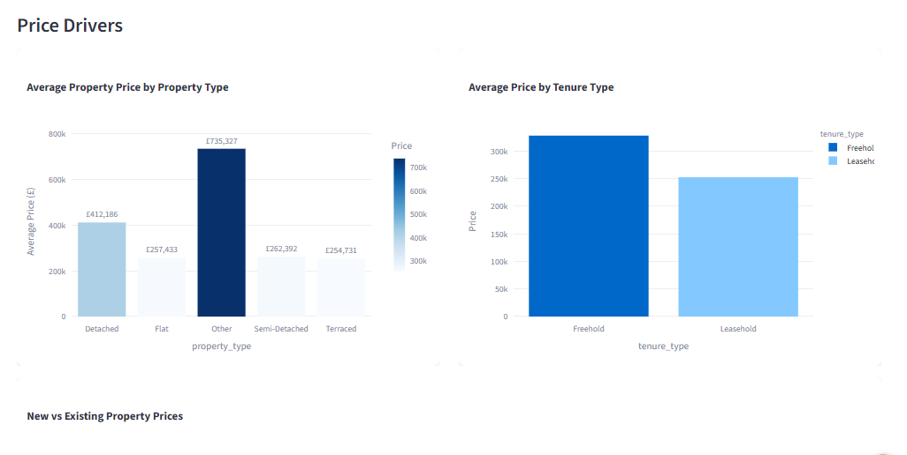
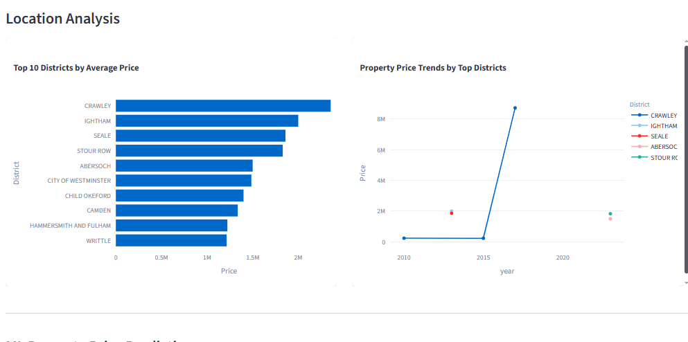
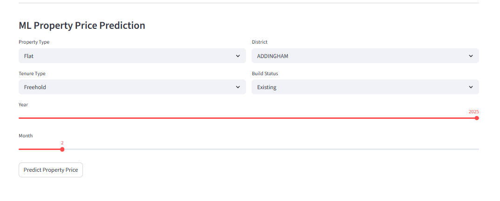

# UK Property Price Analytics Dashboard with Price Prediction

## Overview

This project analyzes UK property price data through an interactive Streamlit dashboard. Users can explore property market trends and generate estimated property prices based on selected characteristics such as district, year, property type, and tenure.

---

## Dashboard Preview

---

## Features

* Interactive dashboard for property market analysis  
* Property price prediction based on selected inputs  
* Data visualization and trend exploration  
* User-friendly Streamlit interface  

---

## Dashboard Screenshots

---

## Tools Used

* Python  
* Pandas  
* Streamlit  
* Scikit-learn  
* Plotly  

## Live Demo

https://ukpropertydashboard-gtgbfxutdfmphrvmvhmtbw.streamlit.app
